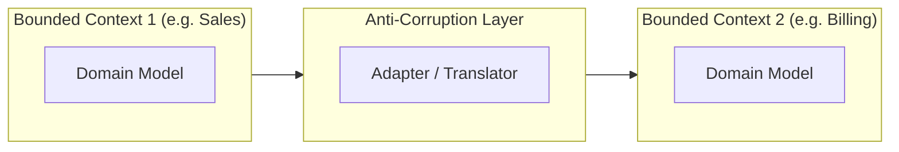
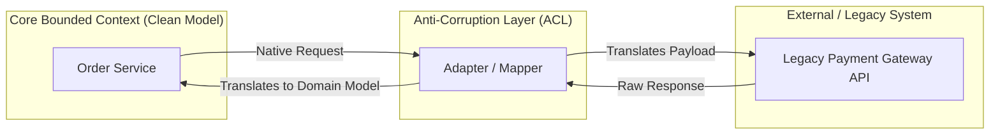
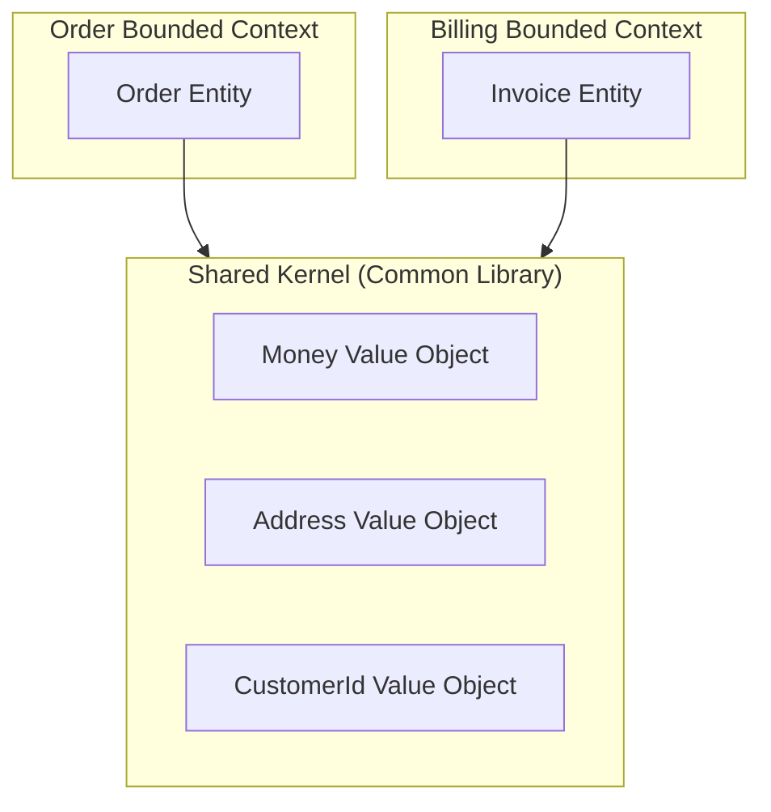
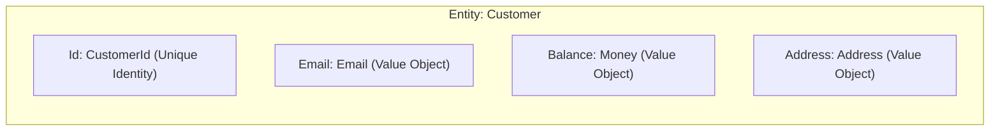
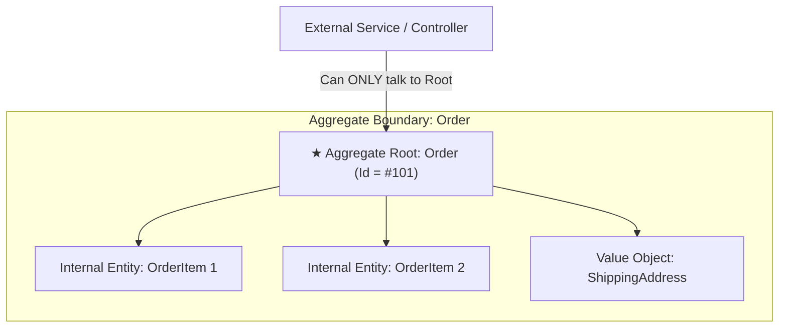
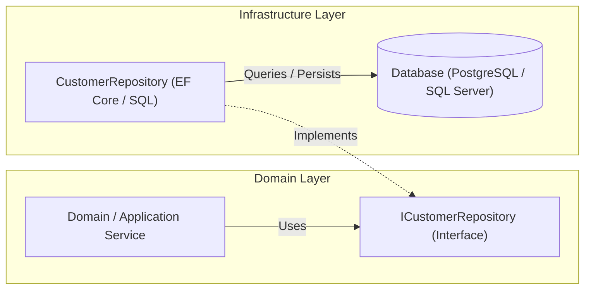
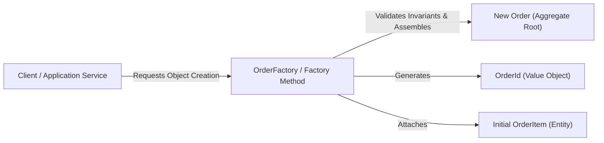
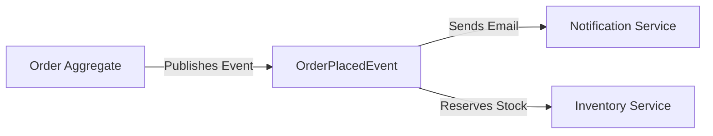

**Domain-Driven Design (DDD)** is an approach that prioritizes understanding the business domain and logic in software development rather than focusing solely on technical aspects. It emphasizes collaboration between domain experts and software developers to create a shared understanding of the problem space.

> [!NOTE]
> DDD basically helps developers to understand clearly about the business logic.


## Table of contents

## Importance of Domain Knowledge

Suppose that we released software using all the latest tech stack and infrastructure, and our software architecture is wonderful. But it is ultimately the end user who decides whether the software is useful or not. If the software does not meet the business requirements, it will be useless no matter how good the technical implementation is. Therefore, understanding the business domain is crucial for building successful software systems.

> "It is not the customer's job to know what they want." — **Steve Jobs**

---

## Strategic Design in Domain-Driven Design (DDD)

- Focus on defining overall architecture of a software that aligns with the problem domain.
- Deal with problems of partitioning the system into manageable parts and how to establish clear boundaries between them.

### 1. Bounded Contexts

- The key idea is to devide a huge system into smaller parts based on domain called **Bounded Contexts**. 
- However, domains can depend on each other.
- Therefore, we need to create a middle layer which is called **Anti-Corruption Layer** between related domains to avoid corruption when changes happen.



---

### 2. Anti-Corruption Layer (ACL)

An **Anti-Corruption Layer (ACL)** is a translation layer placed between two different Bounded Contexts (or between a new modern domain model and an old legacy system).

- **Core Purpose**: Keeps your core domain model clean and pure by isolating it from external changes.
- **How It Works**: It translates incoming and outgoing requests/responses into the native **Ubiquitous Language** of your current domain context.



> [!TIP]
> Use an Anti-Corruption Layer whenever you integrate with external 3rd-party APIs (e.g., Stripe, PayPal), legacy databases, or another team's Bounded Context whose data model is noisy or subject to frequent changes.

---

### 3. Shared Kernel

A **Shared Kernel** is an explicitly shared subset of the domain model and code (e.g., shared Value Objects, common Enums, or common Data Types) that two or more Bounded Contexts agree to share and maintain together.

- **Core Purpose**: Avoids duplicating common core domain concepts (like `Money`, `Currency`, `Address`, or `CustomerId`) across multiple contexts when strict isolation would add unnecessary complexity.
- **Key Rule**: Both teams must **consult and agree** before making any modification to the Shared Kernel code, as any breaking change instantly affects all dependent contexts.



> [!WARNING]
> Keep the Shared Kernel as **small as possible**. The larger the Shared Kernel grows, the more tightly coupled the teams become, reducing team autonomy.


## Tactical Design Patterns in Domain-Driven Design (DDD)

Focus on the specific technical building blocks used to model and implement software within a Bounded Context.

---

### 1. Entity

An **Entity** is an object defined by its unique identity (`Id`) rather than its attributes. Its state can change over time, but its identity remains constant throughout its lifecycle.

- **Identity First**: Two Entities with different IDs are distinct, even if all their other fields are identical.
- **Mutable**: State changes over time (e.g., a User updates their email, but remains the same User).
- **Example**: `User(Id = "usr_101")`, `Order(Id = "#ORD-99")`.

```csharp file="UserEntity.cs"
public class User
{
    public Guid Id { get; private set; } // Unique Identity
    public string Name { get; private set; }
    public string Email { get; private set; }

    public User(Guid id, string name, string email)
    {
        Id = id;
        Name = name;
        Email = email;
    }

    public void ChangeEmail(string newEmail) => Email = newEmail;
}
```

---

### 2. Value Object

A **Value Object** is an immutable object defined strictly by its values. It has **no unique identity** (`Id`).

- **Value-Based Equality**: Two Value Objects are equal if all their attributes have the exact same values.
- **Immutable**: Cannot be modified after creation. Any modification returns a new Value Object instance.
- **Example**: `Money(100, "USD")`, `Address("123 Main St", "NYC")`, `Color(255, 0, 0)`.

```csharp file="MoneyValueObject.cs"
public record Money(decimal Amount, string Currency)
{
    public Money Add(Money other)
    {
        if (Currency != other.Currency)
            throw new InvalidOperationException("Currency mismatch");

        return new Money(Amount + other.Amount, Currency);
    }
}
```

---

### How Value Objects Work as Custom Types for Entities

Instead of relying on generic primitive types (`string`, `decimal`, `int`) which lead to invalid states, **Value Objects** serve as **rich custom domain types** that encapsulate validation and logic for an Entity's attributes.



#### Code Comparison: Primitive Types vs. Value Objects

```csharp file="CustomerEntityComparison.cs"
// ❌ Primitive Obsession: Vulnerable to invalid states & missing context
public class CustomerBad
{
    public Guid Id { get; set; }
    public string Email { get; set; }     // Plain string: can be assigned invalid "abc"
    public decimal Balance { get; set; }   // Plain decimal: missing currency context
}

// ✅ Value Objects as Custom Types: Self-validating & type-safe
public class CustomerGood
{
    public CustomerId Id { get; private set; } // Typed Entity ID
    public Email Email { get; private set; }   // Self-validates email format
    public Money Balance { get; private set; } // Encapsulates Amount + Currency + logic
}
```

---

### 3. Aggregate & Aggregate Root

An **Aggregate** is a cluster of related Entities and Value Objects bound together under a single main Entity called the **Aggregate Root**.

- **Single Entry Point**: External code can **only** reference and mutate the Aggregate Root. Internal entities cannot be modified directly from outside.
- **Consistency Boundary**: Enforces business rules (invariants) across the entire cluster. The entire Aggregate is persisted and loaded as a single atomic unit.
- **Example**: `Order` is the **Aggregate Root**. `OrderItem` (Entity) and `ShippingAddress` (Value Object) live inside the `Order` Aggregate.



```csharp file="OrderAggregate.cs"
public class Order // Aggregate Root
{
    public OrderId Id { get; private set; }
    private readonly List<OrderItem> _items = new();
    public IReadOnlyCollection<OrderItem> Items => _items.AsReadOnly();
    public Money TotalAmount { get; private set; }

    // Business Invariant enforced at Aggregate Root level
    public void AddItem(ProductId productId, Money price, int quantity)
    {
        if (_items.Count >= 100)
            throw new InvalidOperationException("Order cannot exceed 100 items.");

        _items.Add(new OrderItem(productId, price, quantity));
        TotalAmount = TotalAmount.Add(price.Multiply(quantity));
    }
}
```

> [!IMPORTANT]
> Always modify internal entities via methods on the **Aggregate Root** (e.g. `order.AddItem(...)`). Never allow repositories or external services to directly update internal `OrderItem` rows in the database.

---

### 4. Repository

A **Repository** encapsulates data access logic, providing an in-memory collection-like interface for querying and persisting **Aggregate Roots**.

- **Decouple Data Access**: Separates the core domain model from underlying database details (e.g., Entity Framework Core, Dapper, SQL, MongoDB).
- **Operate on Aggregate Roots Only**: Repositories should **only** exist for Aggregate Roots (e.g., `ICustomerRepository`, `IOrderRepository`), never for internal child entities (`OrderItem`).
- **Hide Storage Specifics**: Encapsulates the translation between domain objects and data storage methods (databases or external services).



```csharp file="CustomerRepository.cs"
// 1. Interface defined in Domain Layer (Ubiquitous Language)
public interface ICustomerRepository
{
    Task<Customer?> GetByIdAsync(CustomerId id, CancellationToken ct = default);
    Task AddAsync(Customer customer, CancellationToken ct = default);
    Task SaveChangesAsync(CancellationToken ct = default);
}

// 2. Implementation in Infrastructure Layer
public class CustomerRepository : ICustomerRepository
{
    private readonly AppDbContext _context;

    public CustomerRepository(AppDbContext context) => _context = context;

    public async Task<Customer?> GetByIdAsync(CustomerId id, CancellationToken ct = default)
        => await _context.Customers.FirstOrDefaultAsync(c => c.Id == id, ct);

    public async Task AddAsync(Customer customer, CancellationToken ct = default)
        => await _context.Customers.AddAsync(customer, ct);

    public async Task SaveChangesAsync(CancellationToken ct = default)
        => await _context.SaveChangesAsync(ct);
}
```

> [!NOTE]
> Define Repository **interfaces** inside the Domain Layer to preserve the Dependency Inversion Principle (DIP). Place the concrete **implementations** in the Infrastructure Layer.

---

### 5. Factory

A **Factory** is a creational pattern used to encapsulate complex instantiation logic and business validation when creating **Entities** or **Aggregates**.



```csharp file="OrderFactory.cs"
// Factory encapsulating complex Aggregate creation logic
public static class OrderFactory
{
    public static Order CreateNewOrder(CustomerId customerId, List<OrderItemDto> itemDtos)
    {
        if (itemDtos == null || itemDtos.Count == 0)
            throw new DomainException("An order must contain at least one item upon creation.");

        var orderId = new OrderId(Guid.NewGuid());
        var order = new Order(orderId, customerId);

        foreach (var dto in itemDtos)
        {
            order.AddItem(dto.ProductId, dto.Price, dto.Quantity);
        }

        return order;
    }
}
```

> [!TIP]
> Simple objects can be created directly via constructors. Use a **Factory** only when object creation involves complex business rules, multiple child entities, or specific construction algorithms.

---

### 6. Services in DDD

When an operation doesn't belong to a single Entity, we use a Service:

1. **Domain Service**: Handles business logic between 2 different modules or aggregates (e.g., placing an order in **Order Module** while checking stock in **Inventory Module**).
2. **Shared Service**: Handles common technical utilities used across the whole system (e.g., file upload, sending emails).

```csharp file="ServicesExample.cs"
// 1. Domain Service: Business logic connecting 2 DIFFERENT modules (Order & Inventory)
public class OrderCheckoutService
{
    private readonly IInventoryService _inventoryService; // Inventory Module

    public OrderCheckoutService(IInventoryService inventoryService)
    {
        _inventoryService = inventoryService;
    }

    public void Checkout(Order order) // Order Module
    {
        if (!_inventoryService.HasStock(order.ProductId, order.Quantity))
            throw new DomainException("Out of stock.");

        _inventoryService.ReserveStock(order.ProductId, order.Quantity);
        order.ConfirmOrder();
    }
}

// 2. Shared Service: Common system utility (File Upload)
public interface IFileUploadService
{
    Task<string> UploadFileAsync(Stream fileStream, string fileName);
}
```

---

### 7. Domain Event

A **Domain Event** is an immutable record representing something significant that occurred in the domain in the past (e.g., `OrderPlacedEvent`, `PaymentReceivedEvent`).

- **Named in Past Tense**: Always named after an event that already happened (`OrderPlaced`, `UserRegistered`).
- **Decouples Modules**: Allows other Aggregates or modules (e.g., Notification or Inventory) to react asynchronously without direct coupling.



```csharp file="DomainEventsImplementation.cs"
// 1. Define Domain Event (Immutable record, past tense)
public interface IDomainEvent { DateTime OccurredOn { get; } }

public record OrderPlacedEvent(OrderId OrderId, CustomerId CustomerId, DateTime OccurredOn) : IDomainEvent;

// 2. Aggregate raises the event
public class Order
{
    public void PlaceOrder()
    {
        // Business logic...
        AddDomainEvent(new OrderPlacedEvent(Id, CustomerId, DateTime.UtcNow));
    }
}

// 3. Event Handler in Notification Module (Receives & Handles Event)
public class OrderPlacedEventHandler : IDomainEventHandler<OrderPlacedEvent>
{
    private readonly IEmailService _emailService;

    public OrderPlacedEventHandler(IEmailService emailService) => _emailService = emailService;

    public async Task HandleAsync(OrderPlacedEvent domainEvent, CancellationToken ct = default)
    {
        // Reacts to event asynchronously without direct coupling to Order Module
        await _emailService.SendOrderConfirmationAsync(domainEvent.CustomerId, domainEvent.OrderId, ct);
    }
}
```
---

## Conclusion

**Domain-Driven Design (DDD)** provides a proven framework for building maintainable, scalable software.

By placing the business domain at the core. By mastering both **Strategic Design**  and **Tactical Design**, you can build systems that naturally adapt to evolving business requirements.

*Thank you for reading! Happy coding! 🚀*


