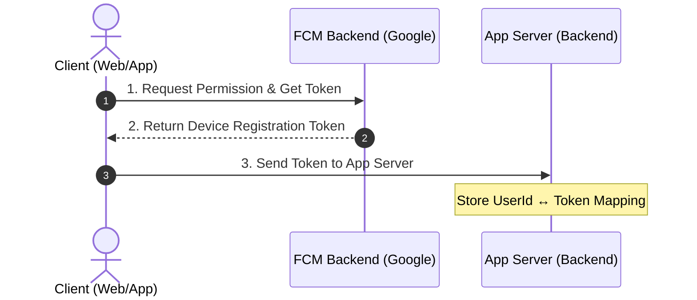
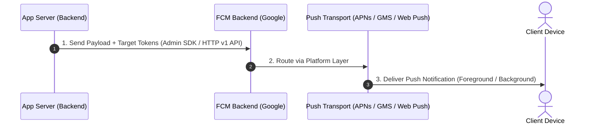

**Firebase Cloud Messaging (FCM)** is a powerful, cross-platform messaging solution from Google that allows you to send notification messages and data payloads reliably across Android, iOS, and Web devices at no cost.


## Table of contents

## Key Capabilities of FCM

> [!NOTE]
> FCM provides a unified backend infrastructure for real-time app notifications, targeted messaging, and background sync.

1. **Notification Messages & Data Messages**:
   - **Notification Messages**: Display automated UI alerts handled directly by the client SDK when the app is in the background.
   - **Data Messages**: Custom JSON key-value pairs processed directly by your app code for client-side custom logic.
2. **Versatile Message Targeting**: Send messages to single devices, device groups, or topics using pub/sub subscriptions.

---

## How Does It Work?

An FCM implementation requires two core architectural layers:

1. **A Trusted Server Environment** (App Server, Cloud Functions, or backend microservices) to build, target, and authorize message requests.
2. **A Client App** (iOS, Android, or Web) equipped with the platform-specific FCM Client SDK to receive tokens and incoming messages.

---

## FCM Architectural Overview

### Flow 1: Device Registration

When a user opens your application, the client app requests push permissions and retrieves a unique **Device Registration Token** from Google's FCM Backend, then saves this token to your backend database.



### Flow 2: Push Notification Delivery

When a notification needs to be sent, your server sends a payload request targeting a specific device token (or topic) to FCM. FCM validates the request and routes it through the respective platform transport provider.



---

## Setting Up Your Server Environment

The server component of Firebase Cloud Messaging consists of:
- **Google FCM Backend**: Processes, queues, and dispatches message payloads.
- **App Server / Trusted Backend**: Generates payloads, manages target tokens, and handles HTTP API authentication.

> [!TIP]
> Your app server sends authenticated message requests to FCM HTTP v1 API endpoints. FCM then routes the notification to the target client device.

### Server Requirements

- **Formatted Request Payload**: Must conform to FCM HTTP v1 JSON schema.
- **Exponential Back-off Handling**: Implement retry logic with exponential back-off for transient network errors (`5xx` errors or rate limits).
- **Secure Token Storage**: Securely persist service account credentials and device registration tokens in your backend store.

### Required Credentials

| Credential | Description |
| :--- | :--- |
| `Project ID` | Unique identifier for your Firebase project, required in FCM v1 HTTP endpoints. |
| `Registration Token` | Unique token assigned to an individual client app instance. |
| `Sender ID` | Numerical project identifier associated with your Firebase project number. |
| `Access Token` | Short-lived OAuth 2.0 bearer token used to authenticate HTTP v1 API requests. |

---

## Interacting with FCM Servers

You can send notifications from your app server using two primary options:
1. **Firebase Admin SDK** (Recommended): Available for Node.js, Java, C#, Python, and Go.
2. **FCM HTTP v1 API**: Standard RESTful API for custom language environments.

---

## Code Examples

### 1. Send Messages via Firebase Admin SDK (C#)

#### Full Backend Connection & Single Device Message

```csharp file="Program.cs"
using FirebaseAdmin;
using FirebaseAdmin.Messaging;
using Google.Apis.Auth.OAuth2;
using System;
using System.Collections.Generic;
using System.IO;

string credentialPath = Path.Combine(AppDomain.CurrentDomain.BaseDirectory, "firebase-service-account.json");
if (!File.Exists(credentialPath)) credentialPath = "firebase-service-account.json";

var credential = CredentialFactory.FromFile<ServiceAccountCredential>(credentialPath).ToGoogleCredential();

FirebaseApp.Create(new AppOptions
{
    Credential = credential
});

Console.WriteLine("✅ Firebase Admin SDK initialized successfully!");

string fid = args.Length > 0 ? args[0].Trim() : "";
if (string.IsNullOrWhiteSpace(fid))
{
    Console.Write("\n🔑 Enter FCM Device Token / FID from Web Client: ");
    fid = Console.ReadLine()?.Trim() ?? "";
}

if (string.IsNullOrWhiteSpace(fid))
{
    Console.WriteLine("⚠️ Device Token is missing.");
    return;
}

// 3. Create FCM message payload using Fid instead of Token
var message = new Message()
{
    Fid = fid,
    Notification = new Notification()
    {
        Title = "🔔 Order Approval",
        Body = "Order #123 has been created successfully!"
    },
    Data = new Dictionary<string, string>()
    {
        { "orderId", "123" },
        { "action", "approve" }
    }
};

// 4. Send notification to Firebase Server
try
{
    Console.WriteLine($"🚀 Sending notification...");
    string response = await FirebaseMessaging.DefaultInstance.SendAsync(message);
    Console.WriteLine($"🎉 Sent successfully! Message ID: {response}");
}
catch (FirebaseMessagingException ex)
{
    Console.WriteLine($"❌ FCM Send Error: {ex.Message} (Code: {ex.MessagingErrorCode})");
}
```

#### Send Multicast Messages (Multiple Devices)

```csharp file="FcmMulticastService.cs"
using FirebaseAdmin;
using FirebaseAdmin.Messaging;

var fids = new List<string>()
{
    "YOUR_REGISTERED_TOKEN_1",
    "YOUR_REGISTERED_TOKEN_2",
    "YOUR_REGISTERED_TOKEN_N"
};

var message = new MulticastMessage()
{
    Data = new Dictionary<string, string>()
    {
        { "score", "200" },
        { "time", "3:00" }
    },
    Fids = fids
};

var response = await FirebaseMessaging.DefaultInstance.SendEachForMulticastAsync(message);

if (response.FailureCount > 0)
{
    var failedFids = new List<string>();
    for (int i = 0; i < response.Responses.Count; i++)
    {
        if (!response.Responses[i].IsSuccess)
        {
            failedFids.Add(fids[i]);
        }
    }
    Console.WriteLine($"List of FIDs that failed: {string.Join(", ", failedFids)}");
}
```

---

### 2. Receive Messages in Web Apps (JavaScript)

#### Add and Initialize FCM SDK

```javascript file="firebase-init.js"
import { initializeApp } from "firebase/app";
import { getMessaging } from "firebase/messaging";

const firebaseConfig = {
    // ...
};

// Initialize Firebase
const app = initializeApp(firebaseConfig);

// Initialize Firebase Cloud Messaging
const messaging = getMessaging(app);
```

#### Configure Web Credentials with FCM

- FCM Web uses Web credentials called Voluntary Application Server Identification, or VAPID Keys, to authorize send requests to support web push services.
- You can either **generate a new key pair** or **import your existing key pair** through the Firebase console.

#### Configure Web credentials in your app

The method `register(): Promise<void>` allows FCM to use the VAPID key credential when sending message requests to different push services.

```javascript file="firebase-register.js"
import { getMessaging, register } from "firebase/messaging";

const messaging = getMessaging();
// Add the public key generated from the Firebase console here.
register(messaging, { vapidKey: "BKagOny0KF_2pCJQ3m....moL0ewzQ8rZu" });
```

#### Access the Firebase Installation ID (FID)

To register the app instance and retrieve the Firebase Installation ID (FID) for message targeting:

```javascript file="firebase-fid.js"
import { getMessaging, onRegistered, register } from "firebase/messaging";

const messaging = getMessaging();

// Implement callback to receive the Firebase installation ID upon registration.
onRegistered(messaging, (installationId) => {
  console.log("Registered installation ID:", installationId);

  // Send the Firebase Installation ID to your app server and update the UI if needed.
  sendRegistrationToServer(installationId);
});

// Get installationId
register(messaging, {
  vapidKey: "<YOUR_PUBLIC_VAPID_KEY_HERE>"
}).then(() => {
  // Success! The Firebase Installation ID can be used to target messages to this app
}).catch((err) => {
  console.error("An error occurred while registering", err);
});
```

The `onRegistered` callback is triggered in three scenarios:
- Every time a manual `register()` call finishes.
- A Firebase Installation ID change is detected.
- A `pushsubscriptionchange` event is fired.

After you've obtained the Firebase Installation ID, send it to your app server and store it using your preferred method.

