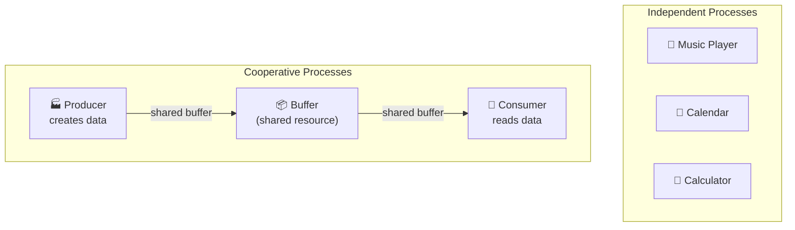
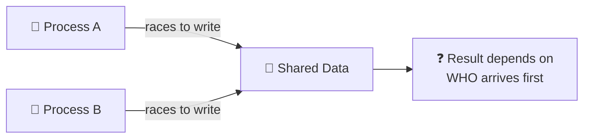
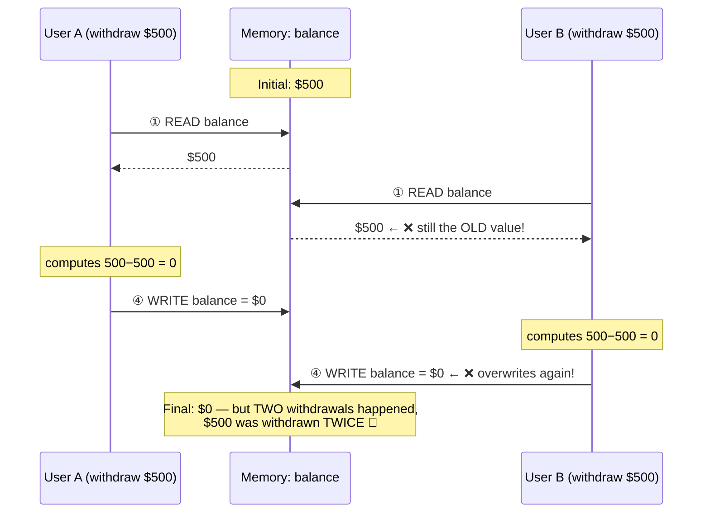
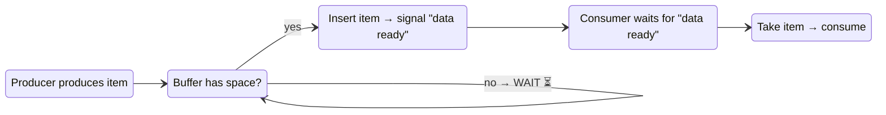
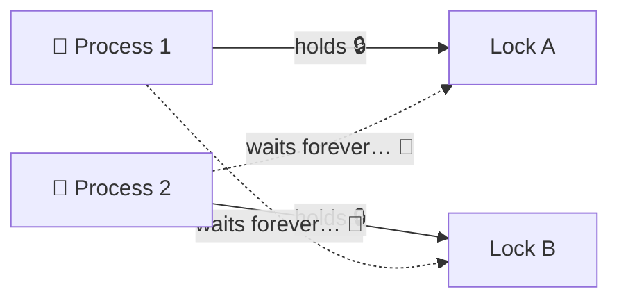
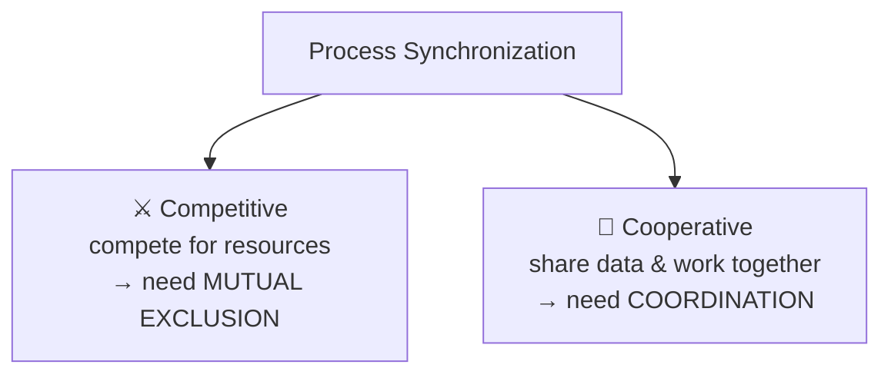

**Process synchronization** is a mechanism used in operating systems to manage processes that access shared resources. It helps prevent **race conditions** and other synchronization problems when multiple processes run at the same time.

In this blog, we will explore *process concurrency* in operating systems: first understand the problem (**race conditions**), then learn how synchronization mechanisms solve them step by step.

> [!NOTE]
> Think of it like many people cooking in one kitchen: without rules ("only one person can use the stove at a time"), they will bump into each other and ruin the food.


## Table of contents

---

## Types of processes

Basically, processes can be classified into two types:

* **Independent Process**: The execution of one process does not affect the others.
* **Cooperative Process**: A process can affect or be affected by other processes.



| | Independent | Cooperative |
|---|---|---|
| Share data? | ❌ No | ✅ Yes |
| Affect each other? | ❌ No | ✅ Yes |
| Example | Music player & Calculator | Producer & Consumer |
| Need synchronization? | No | **Yes** |

Only **cooperative processes** cause concurrency problems, because they share data or resources. That is why we need synchronization.

---

## Race Condition — The Problem

Before learning how to handle concurrency, we need to understand what can go wrong without it.

### What is a Race Condition?

A **race condition** occurs when multiple threads or processes access shared data concurrently, and the final result depends on **the order of execution** — like runners racing to reach the shared data first.



> [!NOTE]
> Same input, different execution order → different results. This unpredictability is the danger.

### Scenario: Two withdrawals from one bank account

Suppose two people withdraw money simultaneously from the same bank account ($500). The withdrawal code looks harmless:

```c
// Shared variable — accessed by BOTH users
int balance = 500;

void withdraw(int amount) {
    int current = balance;           // ① READ the balance
    if (current >= amount) {         // ② CHECK enough money?
        current = current - amount;  // ③ COMPUTE new balance
        balance = current;           // ④ WRITE back
    }
}
```

Each step alone is fine. But when two processes interleave their steps, disaster happens:



Step-by-step timeline:

```txt
Time   User A                        User B                    balance
────   ──────────────────────────    ──────────────────────    ───────
t1     READ      → sees 500                                    500
t2                                   READ     → sees 500       500  ❌ old value
t3     CHECK     → 500 ≥ 500 ✓                                 500
t4     COMPUTE   → 500 − 500 = 0                               500
t5                                   CHECK     → 500 ≥ 500 ✓   500  ❌ should fail!
t6     WRITE     → set 0                                       0
t7                                   COMPUTE   → 500 − 500 = 0   0
t8                                   WRITE     → set 0          0  ❌ double spend!

Result: both withdrawals "succeeded" because User B read the
balance BEFORE User A finished updating it.
```

### TOCTOU Vulnerability

A common form of race condition is **TOCTOU (Time-of-Check to Time-of-Use)**: a program checks the state, then later uses that state, assuming it has not changed in between.

In the example above, the gap between **② CHECK** ("balance ≥ $500") and **④ WRITE** is exactly where things break:

```txt
② CHECK:  "balance ≥ $500?" → YES ✓      (checked at time t3)
                │
                │   ⚠️ another process changes the balance HERE
                │      (between checking and using)
                ▼
④ USE:    "balance = balance − $500"      (used at time t6)

→ The check was valid when made, but meaningless when used.
```

This pattern appears everywhere: 
- Checking file permissions before opening a file
- Checking stock before placing an order
- Checking seat availability before booking 

> [!Warning]
> Any "check-then-act" code without locking is vulnerable. 

### Causes of Race Conditions

**1. Simultaneous Access** — two or more processes try to read/write the same shared resource at the same time:

```txt
Process A ──┐
            ├──► 📦 shared resource   ← conflict!
Process B ──┘
```

**2. Non-Atomic Operations** — an operation is not atomic when it can be interrupted midway. 
- The withdrawal above is really 4 separate steps (`READ → CHECK → COMPUTE → WRITE`).
- The OS scheduler can pause a process **between any two steps** to run another process.

**3. Lack of Synchronization Mechanisms** — no mechanisms like *locks*, *semaphores*, or *monitors* to control who accesses the resource and when.

---

## Role of Process Synchronization — The Solutions

Once we understand the problems caused by unsynchronized access to shared resources, we can see why operating systems need **process synchronization**. Below are the main goals synchronization aims to achieve.

### 1. Preventing Race Conditions

Ensure that concurrent accesses to shared data never produce inconsistent results, no matter the execution order — fixing exactly the problem described above.

Now replay the same bank scenario, but this time User B must **wait** until User A finishes:

```txt
Time   User A (holds lock 🔒)           User B (waiting ⏳)         balance
────   ─────────────────────────        ─────────────────────       ───────
t1     LOCK ✓                                                     500
t2     READ      → sees 500             waiting...                 500
t3     CHECK     → 500 ≥ 500 ✓          waiting...                 500
t4     WRITE     → set 0                waiting...                  0
t5     UNLOCK 🔓                           LOCK ✓                     0
t6                                        READ      → sees 0          0
t7                                        CHECK     → 0 < 500 ✗      0
t8                                        → withdrawal rejected ✅   0

Result: exactly ONE withdrawal succeeds. Final balance is correct!
```

Same input, same operations — but now the result is always correct regardless of scheduling. That is what synchronization guarantees.

### 2. Mutual Exclusion (Mutex)
> [!NOTE]
> **Allow only one process inside the critical section at a time.**

A **critical section** is a code segment that accesses shared resources and therefore must be executed by only one process at a time. Every cooperative process follows the same protocol:


```c
do {
    lock(&mutex);            // 🚪 entry section
    /* critical section */   // ⚠️ touch shared data here
    unlock(&mutex);          // 🔓 exit section
    /* remainder section */
} while (true);
```

Think of a mutex as a **single key to a restroom** 🚻: whoever holds the key gets in; everyone else waits outside until the key is returned.

**Banking System example**

- **Critical Section**: Updating an account balance during a deposit or withdrawal.
- **Issue without mutex**: Two simultaneous transactions could lead to an incorrect balance (see the race condition section).
- **With mutex**: Transaction B must wait until Transaction A leaves the critical section, then re-read the **updated** balance.

### 3. Process Coordination

Sometimes processes need to happen **in the right order**, not just exclusively. Classic example — **Producer–Consumer**: the consumer must **wait** if the buffer is empty; the producer must **wait** if the buffer is full.



Without coordination, the consumer might read an **empty buffer** (garbage data), or the producer might overwrite items nobody consumed yet:

```txt
❌ Without coordination:
Producer: [A][B][C][D][E] → buffer FULL, keeps writing → OVERWRITE ❌
Consumer: reads buffer before anything arrives → reads GARBAGE ❌

✅ With coordination:
Producer: writes → "buffer has data!" 
Consumer: hears signal → reads → "buffer has space!"
```

### 4. Deadlock Prevention

A **deadlock** happens when two processes each hold a lock and wait forever for the other's lock — a circular wait where nobody can move:



```txt
Process 1: lock(A) ✓  →  lock(B) … blocked (held by Process 2)
Process 2: lock(B) ✓  →  lock(A) … blocked (held by Process 1)
→ Both stuck FOREVER unless the system intervenes.
```

Synchronization strategies prevent or break this cycle:

- **Lock ordering**: all processes must request locks in the same global order (`always A before B`) → circular wait becomes impossible.
- **Timeouts**: if you cannot get a lock within N seconds, release everything and retry.
- **Detect & recover**: periodically look for cycles in the "who-waits-for-whom" graph; kill or roll back one victim process.
---

## Types of Process Synchronization

The two primary types of process synchronization in an operating system are:

| | **Competitive** | **Cooperative** |
|---|---|---|
| Relationship | Processes **compete** for the same shared resource | Processes **cooperate** by sharing data |
| Analogy | Students fighting for the last slice of pizza 🍕 | Two chefs preparing one dish together 👨‍🍳 |
| Example | Two print jobs sent to one printer | Producer–Consumer sharing a buffer |
| Needs | Mutual exclusion (who goes first?) | Correct ordering & handshaking |



> [!NOTE]
> In practice, most real systems have **both** types at the same time — processes compete for hardware resources while cooperating on shared data.
