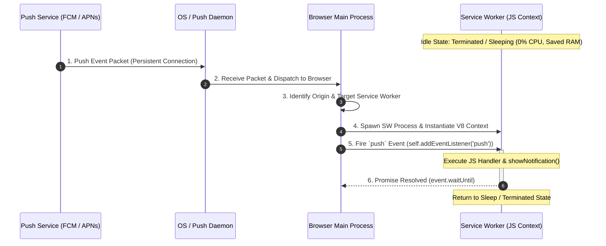
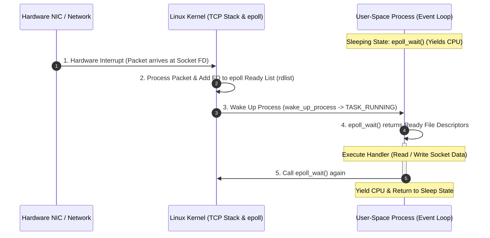
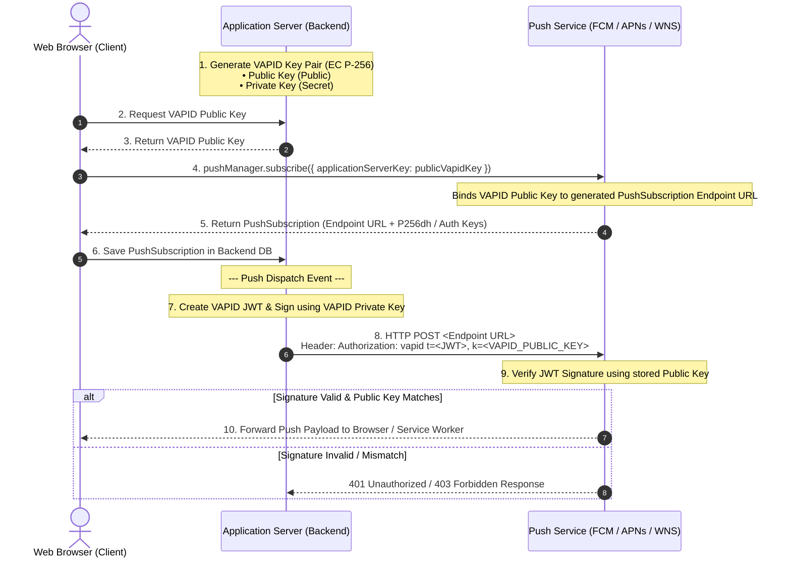

**Web Push Notifications** or **browser notifications** are mechanism that browser daemon maintain **persistent connection** 
to a cloud push service (e.g., FCM, APNs) to receive **near-real-time** messages sent from application servers, waking up browser's **Service worker** even when the website is closed.

> [!TIP]
> Looking for a practical implementation guide using Firebase infrastructure? Check out my guide on [Firebase Cloud Messaging (FCM)](/posts/firebase-cloud-message) for backend server integration and code examples.


## Table of contents
## Browser support for web push notifications
> [!NOTE]
> - IOS does not support web push notifications yet.
> - On mobile browsers, the support is limited to Android devices only (Chrome, Firefox, Opera).

On the desktop, web push notifications are supported by Chrome, Firefox, Safari, Opera and Edge.

## Service worker
> [!NOTE]
> - **Push notification** is handled by the browser's **service worker**. 
> - **A service worker** receives `push` event when it arrives on the device.

Using service worker to subscribe to certain notifications. The [PushManager](https://developer.mozilla.org/en-US/docs/Web/API/PushManager) interface of the [Push API](https://developer.mozilla.org/en-US/docs/Web/API/Push_API) provides a way to receive notifications from other servers.

---

## Service Worker Lifecycle & Event Wake-up Flow

To conserve mobile battery, CPU, and RAM, a browser does **not** keep Service Workers running continuously. Instead, Service Workers are kept in a **sleeping/terminated** state until an event occurs.

When a push notification arrives:
1. The **OS / Browser daemon** receives the incoming TCP push packet over a persistent low-power socket connection.
2. The **Browser Main Process** identifies the registered application origin and wakes up (spawns) the Service Worker execution context.
3. The **Service Worker** handles the `push` event, triggers UI notifications via `showNotification()`, and returns to sleep after the `event.waitUntil()` promise resolves.



---

## Architectural Comparison: Web Push vs. Linux `epoll`

The mechanism of putting a process to sleep and waking it up only when an event occurs is heavily inspired by kernel-level event multiplexing, specifically **Linux `epoll`**.

### How Linux `epoll` Works

Instead of constantly polling sockets in a busy loop (which wastes CPU), a server application (like NGINX or Node.js libuv) delegates socket monitoring to the Linux Kernel via `epoll_wait()`. The process goes into a **blocked/sleeping state** (`TASK_INTERRUPTIBLE`) until an I/O event arrives at the Network Interface Card (NIC).



### Architectural Comparison Table

Both Web Push Service Workers and `epoll` share the same event-driven, push-based design pattern:

| Feature | Web Push (Service Worker) | Linux `epoll` System Call |
| :--- | :--- | :--- |
| **Idle State** | SW process is terminated / asleep | User process is blocked sleeping on `epoll_wait()` |
| **Trigger Event** | Incoming push payload packet from Push Gateway | Hardware / Network packet on Socket FD |
| **Event Dispatcher** | Browser Main Process | Linux Kernel (`epoll` ready list) |
| **Resource Efficiency** | 0% CPU & 0 RAM when no push notifications | 0% CPU consuming while waiting for network I/O |

## How push works
** The three key steps to implementing push are: **
### 1. Subscribe a user to push notification
- **Register a service worker**
```javascript
const register = await navigator.serviceWorker.register('/sw.js', {
    scope: '/'
});
```
- **Create a subscription to Push Server using the PushManager.**
1. Getting permission from the user to send them push messages -> The browser will show a popup that asks user to allow the website to receive & show push notifications.
2. Getting a push subscription object from the browser. It contains all the information we need to send a push message to that user.

```javascript
// Create a subscription object to send to the server
const subscription = await register.pushManager.subscribe({
    userVisibleOnly: true,
    applicationServerKey: urlBase64ToUint8Array('<YOUR_PUBLIC_VAPID_KEY>')
});
```

### 2. Understanding VAPID Keys (Voluntary Application Server Identification)

VAPID (RFC 8292) is a security standard using **Asymmetric Elliptic Curve Cryptography (EC P-256 / prime256v1)** that allows application servers to identify themselves to Push Services (such as FCM, APNs, or Mozilla Push Service) without requiring vendor-specific API keys.

It relies on a keypair consisting of a **Public Key** and a **Private Key**:

#### 🔑 VAPID Key Roles: Public vs. Private Key

| Key Type | Storage & Exposure | Primary Purpose |
| :--- | :--- | :--- |
| **Public Key** | Shared publicly (Client JS / Browser) | **Identity Registration & Verification** |
| **Private Key** | Strictly Secret (Server Backend / Env Variables) | **Digital Signature & Authentication** |

---

### VAPID Key Pair Authentication Flow



> [!IMPORTANT]
> - **Never leak your VAPID Private Key** to the client side or source control.
> - If your private key is leaked, any attacker could send push notifications to all subscriptions bound to your public key.


